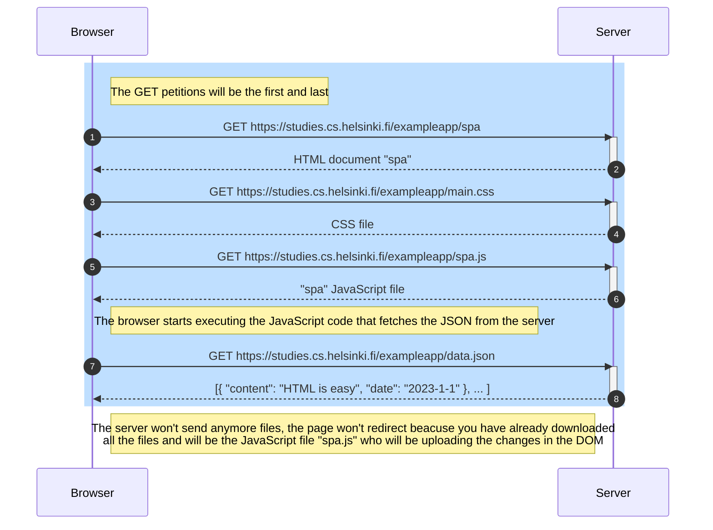

```mermaid
sequenceDiagram
    participant B as Browser
    participant S as Server

    autonumber

    rect rgb(191, 223, 255)

    Note right of B: The GET petitions will be the first and last
    B->>S: GET https://studies.cs.helsinki.fi/exampleapp/spa
    
    activate S
    S-->>B: HTML document "spa"
    deactivate S

    B->>S: GET https://studies.cs.helsinki.fi/exampleapp/main.css
    activate S
    S-->>B: CSS file
    deactivate S

    B->>S: GET https://studies.cs.helsinki.fi/exampleapp/spa.js
    activate S
    S-->>B: "spa" JavaScript file
    deactivate S

    Note right of B: The browser starts executing the JavaScript code that fetches the JSON from the server

    B->>S: GET https://studies.cs.helsinki.fi/exampleapp/data.json
    activate S
    S-->>B: [{ "content": "HTML is easy", "date": "2023-1-1" }, ... ]
    deactivate S

    end

    Note right of B: The server won't send anymore files, the page won't redirect beacuse you have already downloaded <br> all the files and will be the JavaScript file "spa.js" who will be uploading the changes in the DOM
```