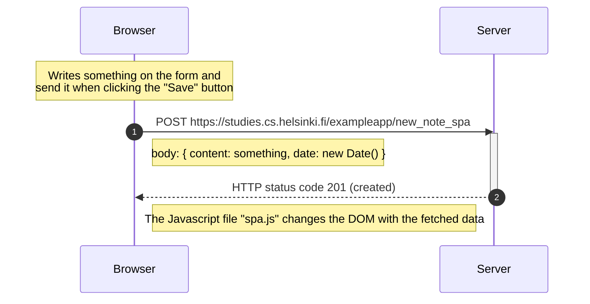

```mermaid
sequenceDiagram
    participant B as Browser
    participant S as Server

    autonumber

    Note over B: Writes something on the form and <br/> send it when clicking the "Save" button

    B->>S: POST https://studies.cs.helsinki.fi/exampleapp/new_note_spa
    activate S
    Note right of B: body: { content: something, date: new Date() }
    S-->>B: HTTP status code 201 (created)
    deactivate S  

    Note right of B: The Javascript file "spa.js" changes the DOM with the fetched data
```